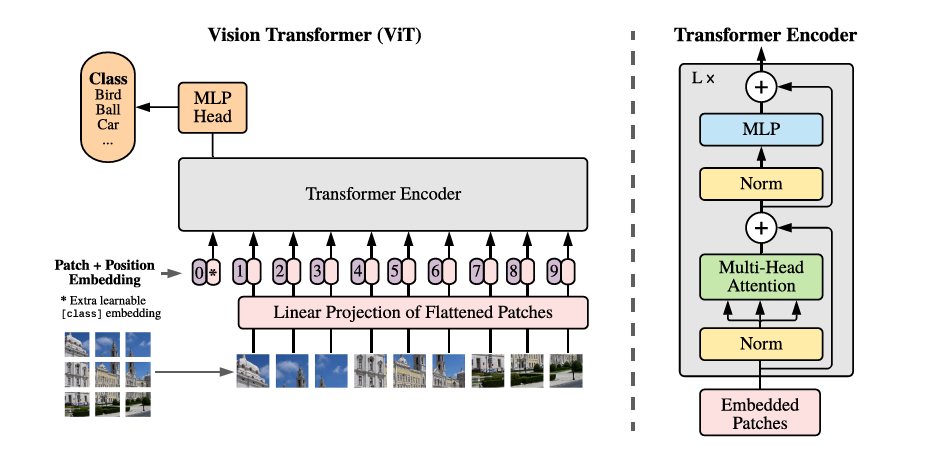

```markdown
# Vision Transformer (ViT) Model

This repository contains an implementation of the Vision Transformer (ViT) model using TensorFlow and Keras. The Vision Transformer is a novel image classification model that utilizes transformer architectures, which have been highly successful in natural language processing tasks.

## VIT Architecture

|  |
| :--:
| *The block diagram of the Vision Transformer along with the Transformer Encoder.* |


## Table of Contents
- [Overview](#overview)
- [Installation](#installation)
- [Usage](#usage)
- [Model Architecture](#model-architecture)
- [Configuration](#configuration)
- [Example](#example)
- [References](#references)

## Overview

The Vision Transformer (ViT) applies the transformer architecture, typically used for text, to image classification tasks. Instead of using convolutional neural networks (CNNs), ViT divides the image into patches, linearly embeds these patches, and processes them using transformer encoders.

## Installation

To use this implementation, you'll need Python 3.x and the following packages:

- TensorFlow
- NumPy

You can install the required packages using `pip`:

```bash
pip install tensorflow numpy
```

## Usage

To use the ViT model, you can follow these steps:

1. Clone this repository:
    ```bash
    https://github.com/BytefulRashi/VIT-Implementation-tf.git
    cd vit-model
    ```

2. Create and summarize the ViT model by running:
    ```bash
    python main.py
    ```

## Model Architecture

The Vision Transformer model consists of the following components:
- **Patch Embedding Layer**: Converts image patches into embeddings.
- **Class Token**: A trainable vector prepended to the sequence of patch embeddings.
- **Positional Embeddings**: Added to patch embeddings to retain positional information.
- **Transformer Encoders**: Stacked transformer encoder layers that process the embeddings.
- **Classification Head**: Final dense layer with softmax activation for classification.

## Configuration

You can configure the model by modifying the parameters in the `config` dictionary:

- `num_layers`: Number of transformer encoder layers.
- `hidden_dim`: Dimensionality of hidden layers.
- `mlp_dim`: Dimensionality of the MLP block.
- `num_heads`: Number of attention heads.
- `dropout_rate`: Dropout rate for regularization.
- `num_patches`: Number of patches the input image is divided into.
- `patch_size`: Size of each image patch.
- `num_channels`: Number of channels in the input image.

## Example

Here is an example configuration and usage:

```python
if __name__ == "__main__":
    config = {
        "num_layers": 12,
        "hidden_dim": 768,
        "mlp_dim": 3072,
        "num_heads": 12,
        "dropout_rate": 0.1,
        "num_patches": 256,
        "patch_size": 32,
        "num_channels": 3,
    }

    vit_model = VisionTransformer(config)
    vit_model.summary()
```

## References

- [An Image is Worth 16x16 Words: Transformers for Image Recognition at Scale](https://arxiv.org/abs/2010.11929) by Alexey Dosovitskiy et al.
- TensorFlow documentation for [MultiHeadAttention](https://www.tensorflow.org/api_docs/python/tf/keras/layers/MultiHeadAttention).
